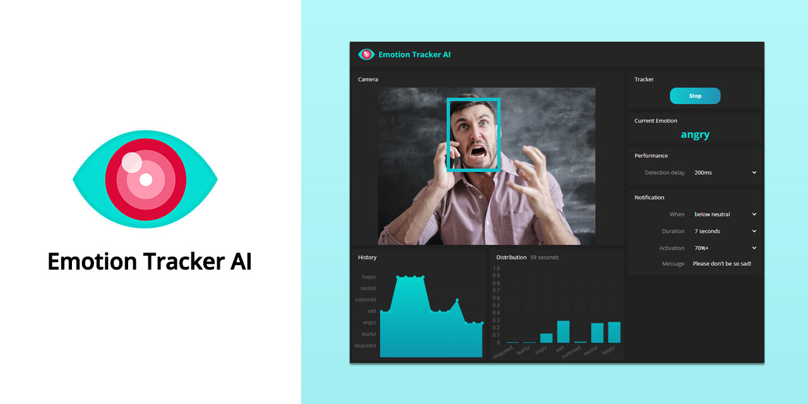
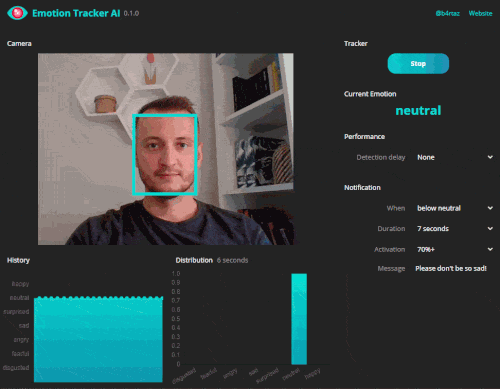

# Emotion Tracker AI

[](https://travis-ci.org/b4rtaz/emotion-tracker) [](/LICENSE) [](https://twitter.com/b4rtaz)

Track your mood during the job. Get notifications when you are sad or unsatisfied. Emotions Tracker is powered by artificial intelligence ([face-api.js](https://github.com/justadudewhohacks/face-api.js/)).

<p align="center"></p>

## ⚙️ How to Run

#### Windows

Download [binaries](https://github.com/b4rtaz/emotion-tracker/releases).

#### Linux, MacOS

[Node.js](https://nodejs.org/en/) is required.

```
npm install
npm run electron
```

#### Online Demo

There is also available [online demo](https://emotion-tracker.n4no.com/demo/), but it doesn't support notifications.

## 🤝 Contributing

Contributions, issues and feature requests are welcome!

## 💡 License

This project is released under the MIT license.
